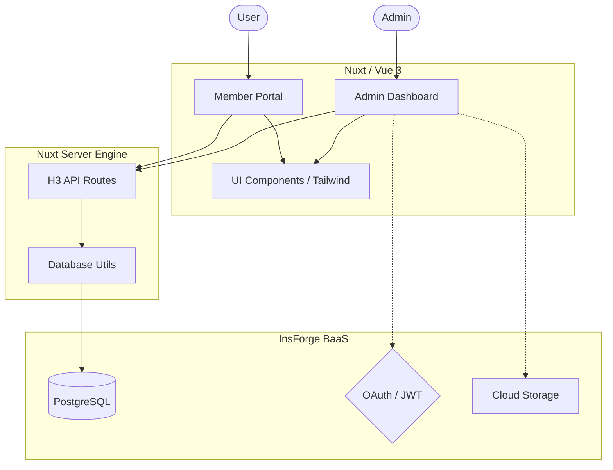
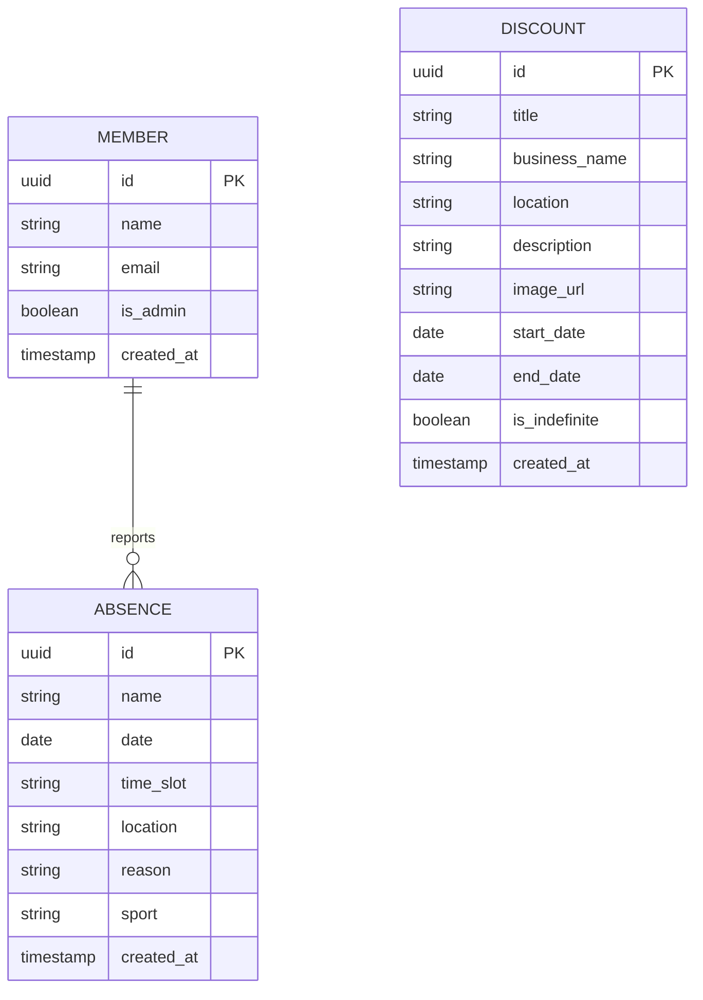

# 🏗️ Architecture & Community Infrastructure

Sharkes is a custom-engineered system designed to modernize operations for the **Sharkes Community in CDMX**. This ad-hoc architecture prioritizes high-performance and developer-friendly abstractions, serving as a real-world case study for building integrated community platforms.

## 🌐 Overview

The application follows a modern **Jamstack** architecture:
- **Frontend**: Nuxt / Vue 3 (SSG/SSR hybrid)
- **Backend-as-a-Service**: InsForge (PostgreSQL, Auth, Storage)
- **Deployment**: Vercel / Netlify



## 🔀 Dual Deployment Strategy

The application leverages a unified backend logic but is deployed into two distinct environments to ensure testing safety and production stability:

1. **Production Deployment**: 
   - Uses standard, production-ready tables and authentication flows.
   - Connected to the primary InsForge project.
   - Designed for end-users and community members.

2. **Demo Deployment**: 
   - A completely secondary project serving as a staging/demo environment.
   - Driven by the `NUXT_PUBLIC_DEMO_MODE=true` environment variable.
   - Utilizes testing infrastructure and includes "admin bypass" functionalities to easily demonstrate features without requiring standard authentication flows.

## 📁 Directory Structure

```text
├── app/
│   ├── components/    # Reusable Vue components
│   ├── layouts/       # Nuxt Page Layouts
│   ├── pages/         # Application Routes (index, admin)
│   ├── plugins/       # Client-side plugins
│   └── utils/         # Helper functions & SDK initialization
├── public/            # Static assets (logos, banners)
├── server/
│   ├── api/           # Server-side API endpoints (H3)
│   └── utils/         # Server-side utilities
└── nuxt.config.ts     # Main framework configuration
```

## 🛠️ Core Technologies

### Nuxt / Vue
We use Nuxt for its powerful routing, automatic imports, and server-side rendering capabilities. Vue 3's Composition API provides a robust way to manage complex component logic.

### InsForge Integration
InsForge acts as our unified backend. We use:
- **Database**: PostgreSQL with PostgREST for direct API access.
- **Auth**: Google OAuth for admin authentication.
- **Storage**: Image storage for team assets and coupons.

### Design System
Our design system is built on **Tailwind CSS**, featuring:
- **Custom Color Palette**: Integrated "Pride" gradients and Slate UI.
- **Glassmorphism**: Backdrop blur effects for a premium feel.
- **Animations**: CSS transitions and Vue transitions for smooth UI state changes.

## 📊 Data Model



## 🔒 Security

- **Admin Access**: Protected by session-based authentication. Only authorized emails can access the admin dashboard.
- **API Safety**: Server-side logic handles sensitive data transformations and verification.
- **Environment Variables**: All API keys and secrets are managed via `.env` files.

---

*Last updated: March 2026*
