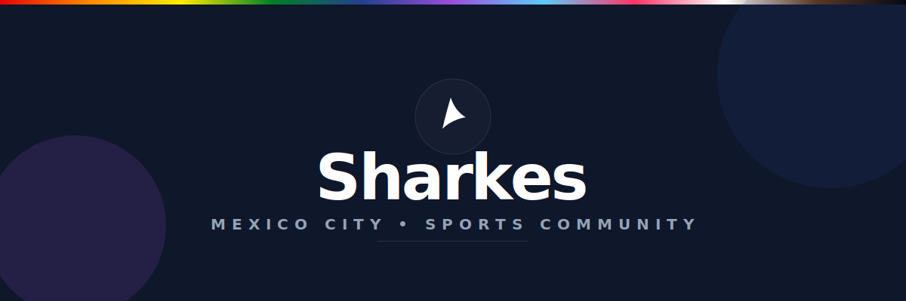
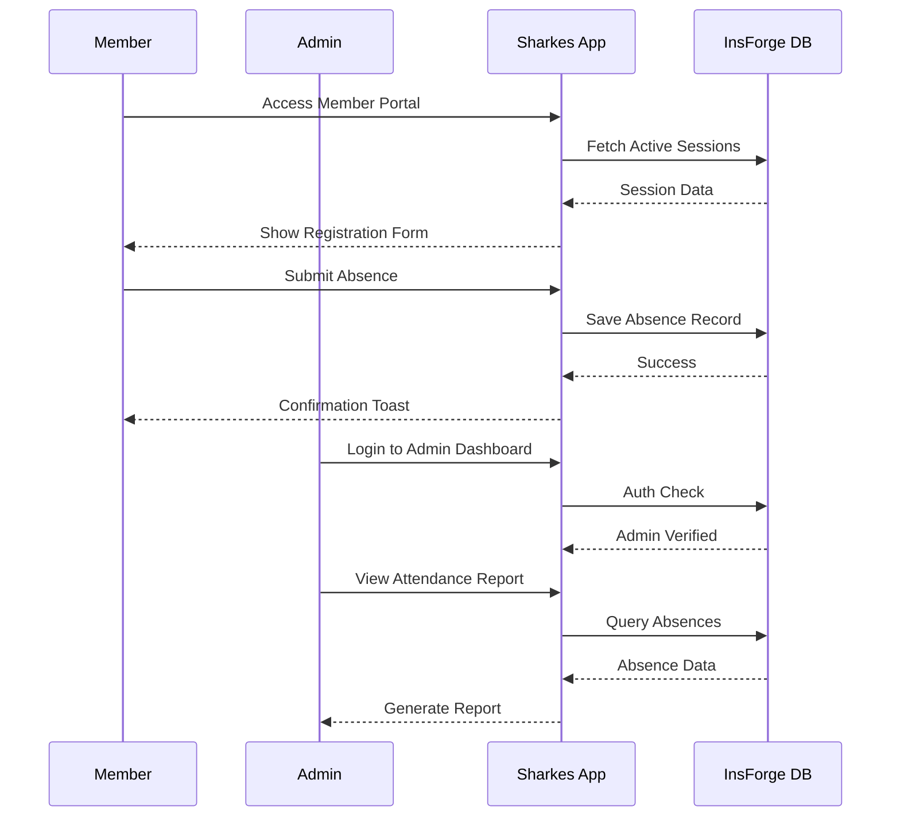
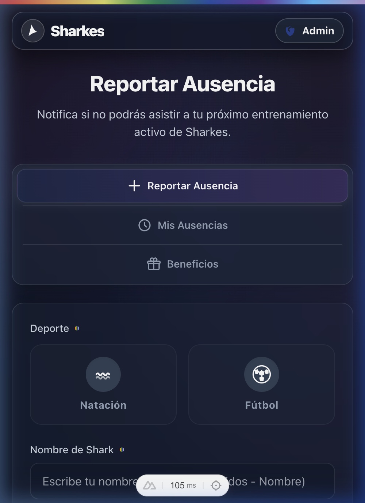
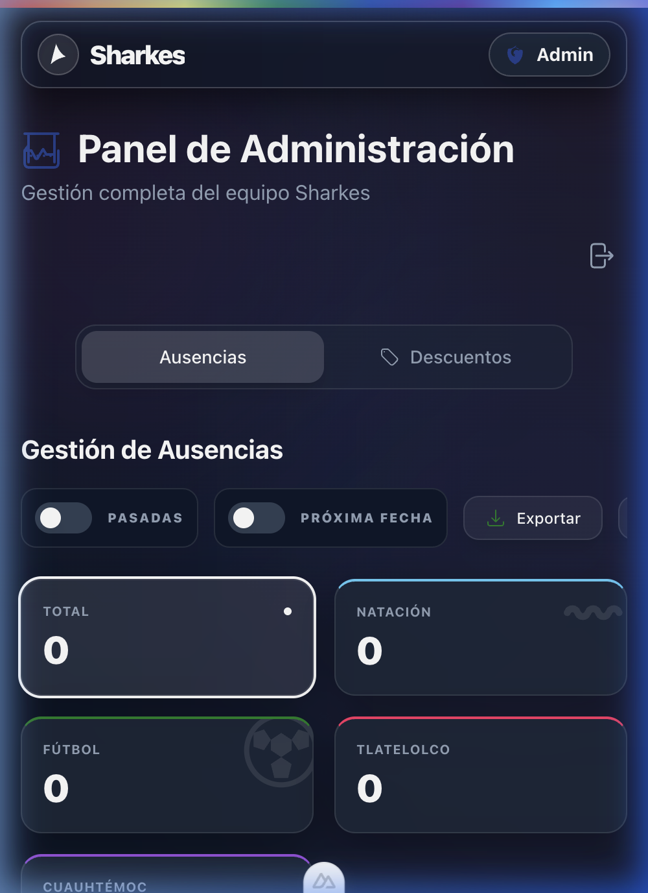
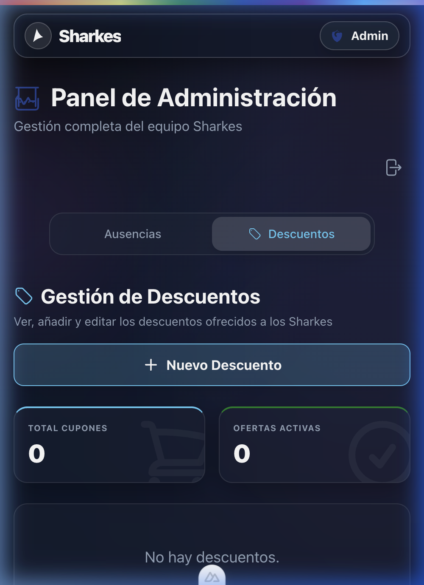

<div align="center">



# 🦈 Sharkes Team Management
### The Digital Home for the Sharkes Sports Community in CDMX

[](https://nuxt.com)
[](https://vuejs.org)
[](https://tailwindcss.com)
[](https://github.com/your-username/sports_team_management)

**Sharkes** is a custom-built digital operations center for the **Sharkes Sports Community in Mexico City**. While it serves as the production hub for our local athletes, it is maintained as an **open-source project** to provide a real-world reference for developers on how to integrate high-performance web systems and build bespoke community solutions.

[✨ Features](#-features) • [🚀 Getting Started](#-getting-started) • [🏗️ Architecture](./ARCHITECTURE.md) • [🤝 Contributing](./CONTRIBUTING.md)

</div>

---

## ✨ Features

### 👤 Member Portal
- **Report Absences**: Simple, intuitive flow to notify the team of absences in upcoming training sessions.
- **My Absences**: Review historical absence reports with a clean, organized interface.
- **Benefits & Perks**: Access exclusive team discounts and benefits via a dedicated coupon system.
- **Responsive Design**: Optimized for desktops and mobile devices (iOS/Android).

### 🔐 Admin Command Center
- **Attendance Overview**: Monitor team presence and manage absence records.
- **Member Management**: Register new players and maintain team rosters.
- **Dynamic Scheduling**: Update training times and locations on the fly.
- **Coupon Control**: Create and manage reward coupons for the team.
- **Secure Access**: Robust authentication using InsForge/Google OAuth.

---

## 🗺️ User Journey



---

## 🚀 Getting Started

### Prerequisites
- Node.js 18+ 
- npm / pnpm / yarn
- An [InsForge](https://insforge.com) project for the backend.

### Local Development

1. **Clone the repository**
   ```bash
   git clone https://github.com/your-username/sports_team_management.git
   cd sports_team_management
   ```

2. **Install dependencies**
   ```bash
   npm install
   ```

3. **Environment Setup**
   Create a `.env` file in the root directory:
   ```env
   NUXT_PUBLIC_INSFORGE_PROJECT_URL=your_project_url
   NUXT_PUBLIC_INSFORGE_ANON_KEY=your_anon_key
   ```

4. **Launch Development Server**
   ```bash
   npm run dev
   ```
   Open `http://localhost:3000` in your browser.

---

---

## 📸 Visual Walkthrough

### 📱 Mobile Experience & UX Flow
Sharkes is fully optimized for mobile devices. See the complete flow—from reporting an absence to discovering community benefits—in our interactive mobile view.


<details>
<summary>View Desktop Interfaces</summary>

### 👤 Member Portal
The member portal is designed for simplicity and speed. Athletes can quickly report their absences for upcoming sessions.



### 🔐 Admin Dashboard
The admin panel provides total control over team operations, including attendance reports and benefit management.

| Absence Management | Discount Management |
|--------------------|---------------------|
|  |  |

</details>

---

## 🛠️ Tech Stack

- **Nuxt 4**: Hybrid Vue Framework for optimal performance.
- **Vue 3**: Composition API (Script Setup) for reactive UI components.
- **Tailwind CSS**: Utility-first CSS for bespoke, premium styling.
- **InsForge SDK**: Real-time database, authentication, and cloud storage.
- **Iconify**: Unified icon system for 100,000+ vector icons.

---

## 📷 Gallery

<details>
<summary>View Interfaces</summary>

| Member Dashboard | Admin Panel | 
|------------------|-------------|
|  |  |

</details>

---

<div align="center">

Built with ❤️ by the Sharkes Development Team.

</div>
